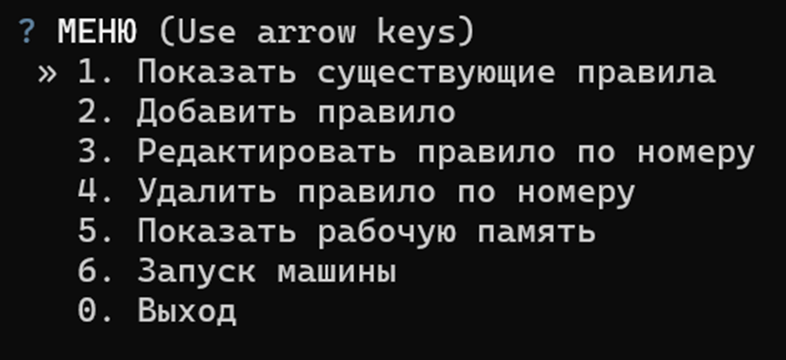

# Требования
Python 3.13

# Развёртывание и запуск
1. Склонируйте репозиторий
```bash
git clone https://github.com/muzilyag/sai_lr1_strukov
```
2. Создайте виртуальное окружение (venv)
```bash
python -m venv .venv
```
3. Активируйте venv
* Windows
```bash
.venv\Scripts\activate
```
* Linux
```bash
source .venv/bin/activate
```
4. Установите зависимости из файла requirements.txt
```bash
pip install -r requirements.txt
```
5. Запустите программу
```bash
python main.py
```

# Описание программы

После запуска программы в терминале покажется интерактивное меню, навигация по которому происходит с помощью клавиш стрелок вниз, вверх и Enter:
1. Показать существующие правила - выводит содержимое файла _kb.json_
2. Добавить правило - добавление нового правила в файл _kb.json_
3. Редактирование правила по номеру - редактирование уже существующего правила в _kb.json_ (необходимо указать номер правила, которое необходимо изменить)
4. Удалить правило по номеру - удаление уже существующего правила в _kb.json_ (необходимо укзаать номер правила, которое необходимо удалить)
5. Показать рабочую память - показывает рабочую память машины (в исходном состояние она пустая, после начала работы машины в нём появится исходное состояние)
6. Запуск машины - инициация алгоритма логического вывода:
* Система загружает в рабочую память исходное состояние
* Для досрочного ответа (если факты у эксперта закончились) нужно выбрать пункт **">>> Закончить размышление"**
* По завершении работы машины будет напечатан либо ответ, либо сообщение, что нет такого правила в базе знаний

# Структура базы знаний
База знаний хранится в JSON-файле _kb.json_ и автоматически обновляется при добавлении, редактировании и удалении правил через меню. Файл имеет следующую структуру
```json
[
    {
        "if": {
            "проблема": "низкий ctr",
            "позиция показа": "высокая",
            "релевантность текста": "низкая"
        },
        "then": {
            "object": "диагноз",
            "value": "нерелевантный текст объявления"
        }
    }
]
```
**Особенности логики**:
* Регистр и пробелы имеют значение - система ищет точные строковые совпадения
* В правилах можно использовать множетсвенные условия (логическая связка "И")
* Блок __then__ содержит только одну пару объекта и значения. Если для одного диагноза требуется вывести и диагноз, и рекомендацию, необходимо разбить это на два связанных каскадных правила

# Линтер
Для запуска линтера необходимо при активированном venv выполнить команду
```bash
ruff check . --fix
```